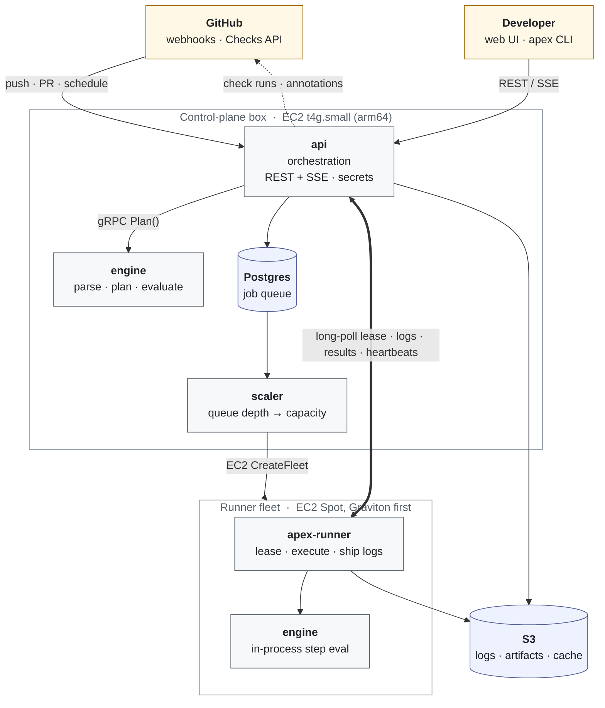

# Apex Actions

**A self-hosted, drop-in replacement for GitHub Actions on lean AWS infrastructure.**

Apex Actions runs your existing `.github/workflows/*.yml` files unchanged, integrates with GitHub as a first-class citizen — Check Runs, annotations, merge gating — and replaces GitHub-hosted runner minutes with AWS Spot compute you control.

Compatibility is the product. Teams only switch if their workflows run as-is on day one, so a conformance suite matches the engine against GitHub's documented behaviour, and every differentiator is built on top of that floor.

[apexactions.com](http://apexactions.com)

---

## How it works



The same engine plans a run on the control plane and evaluates steps inside the runner, so `apex run` on a laptop and a job on the fleet cannot drift apart.

The runtime topology is deliberately lean: a single control-plane EC2 box (`t4g.small`, arm64) running Docker Compose behind Caddy — api, engine, scaler, web and Postgres with pgBackRest backups to S3 — fronted by CloudFront, with a Graviton-first EC2 Spot runner fleet that scales to zero, boots a lean AMI in about 20 seconds, runs a fresh container per job, and idle-terminates after five minutes. The fleet sits in a public subnet with inbound closed and no NAT.

---

## Repositories

The system is organised as a superproject — [`context`](https://github.com/Apex-Actions/context) — which pins every component as a git submodule, owns the lockstep version, and carries the documentation and agent context for the whole fleet.

**The superproject**

| Repository | Path | Language | Role |
|---|---|---|---|
| [`context`](https://github.com/Apex-Actions/context) | `.` | — | Documentation, conventions, submodule pins and the lockstep version |

**Services** — the running system, in `services/`

| Repository | Path | Language | Role |
|---|---|---|---|
| [`engine`](https://github.com/Apex-Actions/engine) | `services/engine` | Go | Workflow parser, planner and expression evaluator |
| [`runner`](https://github.com/Apex-Actions/runner) | `services/runner` | Go | Job execution, log shipping and Spot fleet scaling |
| [`control-plane`](https://github.com/Apex-Actions/control-plane) | `services/control-plane` | TypeScript | GitHub App, orchestration, queue, secrets, REST + SSE |

**Front ends** — what people see

| Repository | Path | Language | Role |
|---|---|---|---|
| [`web`](https://github.com/Apex-Actions/web) | `web` | TypeScript | The product UI, behind GitHub SSO |
| [`www`](https://github.com/Apex-Actions/www) | `www` | TypeScript | The marketing site at apexactions.com |

**Packages** — shared tooling, in `packages/`

| Repository | Path | Language | Role |
|---|---|---|---|
| [`cli`](https://github.com/Apex-Actions/cli) | `packages/cli` | TypeScript | The `apex` developer and operator CLI |
| [`release`](https://github.com/Apex-Actions/release) | `packages/release` | TypeScript | Gitflow + lockstep semver library and CLI |

**Infrastructure**

| Repository | Path | Language | Role |
|---|---|---|---|
| [`infra`](https://github.com/Apex-Actions/infra) | `infra` | TypeScript | AWS CDK application and operational CLI |

**Archived**

| Repository | Path | Language | Role |
|---|---|---|---|
| [`actions`](https://github.com/Apex-Actions/actions) | — | — | Superseded by `context` (ADR-0013) |

### context
The superproject. It contains no code and no configuration beyond the agent `.env` (ADR-0017) — only documentation, templates, conventions and the submodule pins. `docs/` holds the binding conventions (`conventions.md`, §0–§12, which every `§`-reference across the fleet points at), the system map (`architecture.md`), roadmaps, ADRs indexed fleet-wide in `decisions.md`, feature docs, run-books, per-repo briefs in `repos/`, the cost and threat models, and task templates. Start a clone with `git clone --recurse-submodules`; the fleet tooling lives in `packages/release`, not the root.

### engine
The workflow parser, validator, planner and `${{ }}` expression evaluator, in Go. Written once (ADR-0011) and used two ways: in-process as `pkg/engine` by the runner, and over gRPC (`Validate`/`Plan`/`Evaluate`/`Describe`) by the control plane. `apex-engine` also runs standalone as `validate [files…]`, which is the embedded mode `apex validate` shells out to. Owns the conformance suite that proves GitHub parity.

### runner
`apex-runner` executes planned jobs with GitHub's semantics. **Local mode** runs a workflow on a developer machine with Docker — `apex run`, or `go run ./cmd/apex-runner --local --workflow …` — with flags for events, payloads, secrets, vars, inputs, changed files and job images. **Remote lease mode** (`runner.v1`, ADR-0004) connects the same binary to a control plane with a one-time registration token, labels and optional `--ephemeral` operation, and adds fleet lifecycle: IMDS identity, idle exit and Spot drain. `apex-scaler` turns queue depth into EC2 Spot fleet capacity. Owns the runner AMI and the `conformance/` smoke workflows.

### control-plane
The API, in TypeScript on Fastify: GitHub App and webhook ingress, run orchestration, a Postgres job queue using `SKIP LOCKED`, runner leases over `runner.v1` gRPC, secrets with envelope encryption, logs to S3, and REST + SSE for the UI. It boots unconfigured on purpose — `/healthz` answers while `/readyz` names what is missing — and deployed values arrive from SSM Parameter Store. Self-serve billing is optional: with the payment provider's keys absent, the billing routes answer 404. This repository owns `contracts/`, the fleet's contract home for Protobuf and OpenAPI.

### web
The product UI: Next.js with shadcn/ui behind GitHub SSO — repositories, workflows with typed `workflow_dispatch` forms, runs with filters and a job DAG, live logs, re-runs, secrets and variables, runners and settings, plus the fleet's shape. Writes go through Server Actions. The container deliberately holds no credential of its own: the only thing it sends to the API is the caller's session cookie (ADR-0002), and the payment form's publishable key is an identifier rather than a secret.

### www
The marketing site at apexactions.com — a fully prerendered Next.js static export with MDX content under strict validated frontmatter (ADR-0004), a seven-theme palette with a contrast proof (ADR-0003), and section components for the page vocabulary. There is no server: `out/` is synced to a bucket by the infra CLI and served by CloudFront. Its gates include unit and component tests with axe assertions, Playwright against the exported site, and an asserted mobile Lighthouse budget.

### cli
`apex`, the developer and operator CLI (TypeScript, commander), one command per leaf. `apex run` reaches the local runner binary and `apex validate` the engine binary; `apex logs` and `apex dispatch` call the control-plane REST API. Beyond those, `runner`, `cache`, `artifact`, `environment` and `deploy` subcommands cover operator work. The CLI authenticates as the machine principal — a terminal cannot complete GitHub's browser sign-in, and the operator token exists so scripts and boot paths keep working when GitHub is unreachable (control-plane ADR-0006). That token is unscoped and should be treated like a root credential.

### release
The Gitflow and lockstep-semver library, CLI, reusable workflows and commitlint config shared by every repository. `context/VERSION` is the source of truth from which each submodule's `VERSION`, `package.json`, Go ldflags, Docker tags and CDK stack tags are derived, and a bump is one operation across the fleet, with rules aggregated from conventional commits. It also provides the `docs:check`, `context:check` and `version:check` guards.

### infra
The AWS CDK application and the `apex-infra` operational CLI for the lean topology (ADR-0008): the control-plane box as an ASG of one with an Elastic IP, a retained data volume and SSM-driven compose; platform buckets and KMS; IAM including a GitHub OIDC deploy role; the CloudFront edge; alarms; and the Spot runner fleet with a launch template per pool and an Image Builder pipeline. Infrastructure changes and application releases are separate commands on purpose — `cdk:deploy` converges stacks, while `app:deploy --release X.Y.Z` writes a parameter and replaces the instance — and the marketing site is a third path again (`www:provision`, `www:deploy`) that cannot reach the other two. Verification is explicit rather than assumed: `app:verify` compares the running container's image digest against the registry.

### actions
Archived. The superproject moved to `context` (ADR-0013); nothing new lands here.

---

## Getting started

```bash
git clone --recurse-submodules https://github.com/Apex-Actions/context.git
cd context && cp .env.example .env
cd packages/release && pnpm install
pnpm version:check && pnpm context:check && pnpm docs:check
cd ../.. && docker compose -f infra/local/docker-compose.yml up
```

Then read, in order: `docs/conventions.md` (binding), `docs/architecture.md` (the system map), `docs/roadmaps/README.md` (status and planning), and the brief for whichever repository you are working in under `docs/repos/`.

---

## Features

- **Jobs start in seconds** — capacity follows your queue, so a push turns into a running job with no queue position, no warm-up, and larger machines available when you want them.
- **One subscription, not a meter** — a flat monthly plan with larger runners included, instead of a per-minute, per-size meter. Typically about half what a team pays for GitHub-hosted runner minutes.
- **Run it before you push** — the same engine that plans your CI runs on your laptop and in your editor: validate as you type, run the whole job locally with `apex run`.
- **Your workflows, unchanged** — same YAML, same marketplace actions, same check runs. Triggers, matrices, `${{ }}` expressions, reusable workflows, composite and JavaScript actions, caches and artifacts all carry over; installing the GitHub App is the only change GitHub sees.
- **Why did this run happen?** — a verdict for every workflow, including the ones that did not run and why. Flaky tests named automatically, every step timed against its own history, one-line local repro.
- **Secure by default** — short-lived OIDC credentials instead of long-lived keys, protected environments with required reviewers, resolved permissions, and secrets under envelope encryption that never reach a log.

Under the hood: one engine written once (Go) and used both in-process by the runner and over gRPC by the control plane, so local and fleet runs cannot drift; Clean Architecture enforced in CI by `lint:arch`; contract-first Protobuf and OpenAPI with generated clients diffed in CI; and Gitflow with one lockstep semantic version across every repository.

---

## Stack

TypeScript (ESM, Node 24+, strict) for control-plane, web, www, cli, infra and release. Go (1.23+) for engine and runner, where speed and resource footprint matter. AWS CDK for infrastructure; Docker images tagged with the lockstep version; Postgres, S3/MinIO and containerd at runtime.
